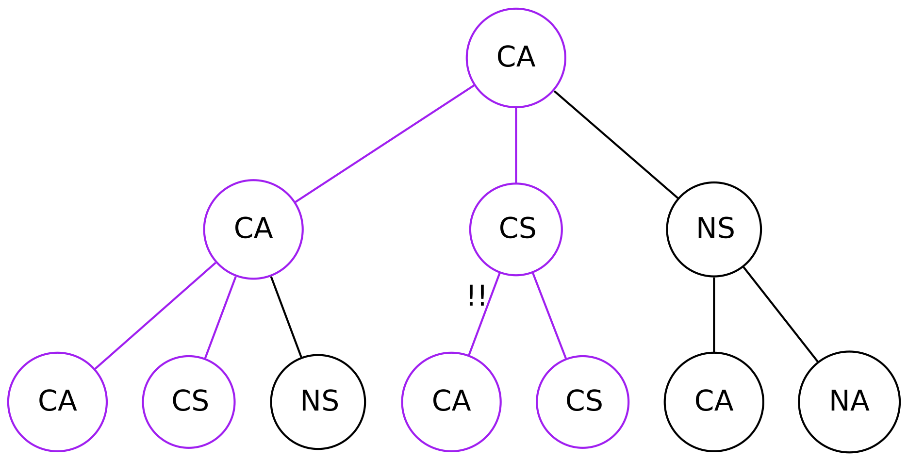
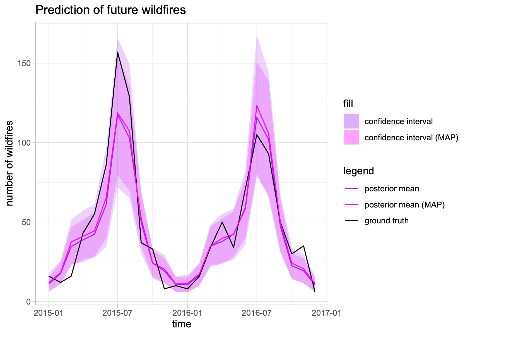

# Portfolio
---
## Data Science

### Modelling the Impact of Contact-tracing Apps in Containing the COVID-19 Virus

**Abstract**

I investigate a percolation model for the ability of contact-tracing programmes to contain the COVID-19 virus proposed by Bulchandani et al. in a 2020 paper. Numerical results are discussed and related to the current epidemic situation.

 

---

### Predicting monthly Wildfires in the US

**Abstract**

In this notebook I am exploring hierarchical Bayesian models in PyMC3 in order to predict the number of wildfires in the US in the future. I will build a Log-Normal-Poisson model which accurately predicts the number of wildfires within a \(1\sigma\)-uncertainty.

 

