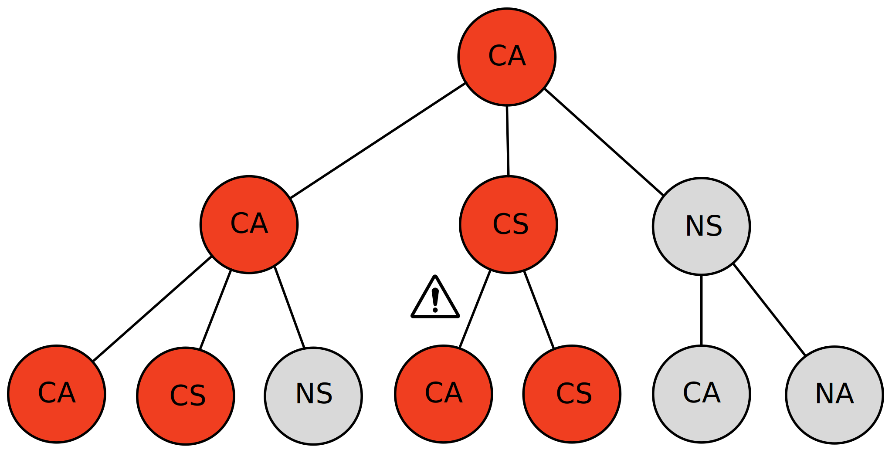

# Portfolio
---
## Data Science

### Modelling the Impact of Contact-tracing Apps in Containing the COVID-19 Virus

**Abstract**

I investigate a percolation model for the ability of contact-tracing programmes to contain the COVID-19 virus proposed by Bulchandani et al. in a 2020 paper. Numerical results are discussed and related to the current epidemic situation.

 

---

### Predicting monthly Wildfires in the US

**Abstract**

In this notebook I am exploring hierarchical Bayesian models in PyMC3 in order to predict the number of wildfires in the US in the future. I will build a Log-Normal-Poisson model which accurately predicts the number of wildfires within a \(1\sigma\)-uncertainty.

 

---

  

## Machine Learning

### Character-level Text Generation with LSTM

**Abstract**

I build a character-level LSTM recurrent neural network (RNN) capable of generating new texts character-by-character. The network was trained on H.P. Lovecraft's short stories.

 

<figure>
    
    <figcaption>Credit: <a href="https://commons.wikimedia.org/wiki/User:Ixnay">fdeloche</a> on Wikipedia</figcaption>
</figure>

